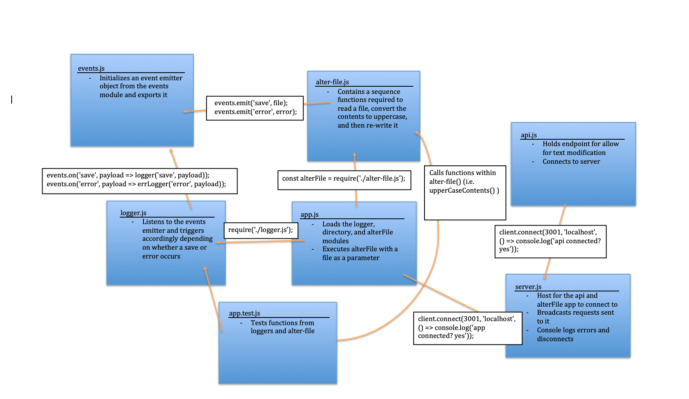

# LAB: TCP Server / Message Application (17)

## Create an event driven application that “distributes” the responsibility for logging to a separate server via TCP , using only events to trigger logging based on activity.

### Author: Earl Jay Caoile

### Links and Resources

- [submission PR](https://github.com/js-401n15-eoc/lab-17/pull/1)
- [GitHub Actions](https://github.com/js-401n15-eoc/lab-17/actions)

#### Documentation

- [Node docs: events](https://nodejs.org/api/events.html)
- [Event-Driven Programming](https://alligator.io/nodejs/event-driven-programming/)

### Setup

- execute the following from the root directory: `npm i events fs jest util`

#### Tests

- Testing command: `npm test` from root directory

#### UML

